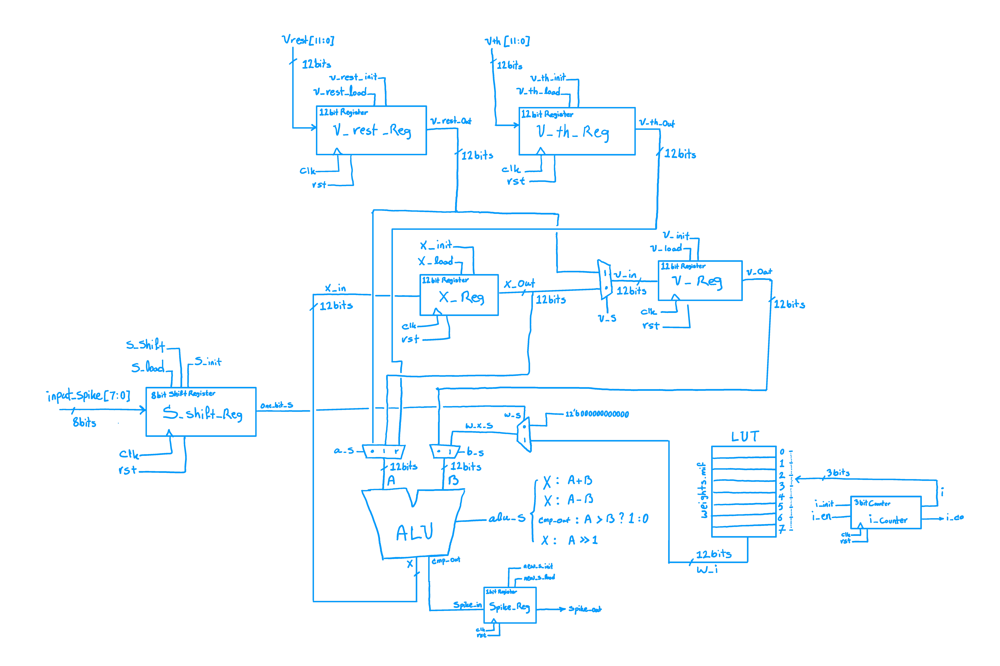
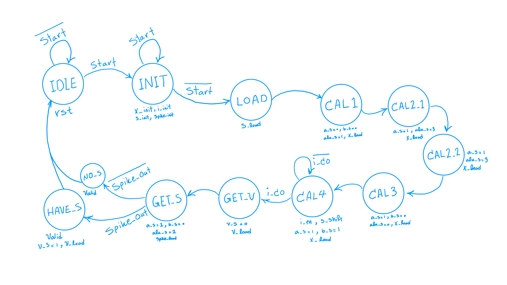

# LIF Spiking Neuron RTL Design

> **Computer Architecture - University of Tehran - Department of Electrical & Computer Engineering**

  

## 📌 Overview

This repository contains the Register Transfer Level (RTL) implementation of a **Leaky Integrate-and-Fire (LIF)** Spiking Neuron. This project was developed as the *First Assignment* for the *Computer Architecture* course at the University of Tehran.

The system is designed to simulate the biological behavior of a neuron, processing input spikes and generating output pulses based on a threshold mechanism. It utilizes a modular design with a distinct separation between the **Datapath** and the **Controller**.

## 🏗️ Architecture

The design is decomposed into a **Datapath Unit** (handling arithmetic operations like integration and leakage) and a **Control Unit** (managing state transitions and control signals).

### 🗺️ DataPath Design

The datapath includes the Arithmetic Logic Unit (ALU), registers for storing membrane potential, and multiplexers for data routing. It also utilizes a Look-Up Table (LUT) for weight management.


### 🎮 ControlUnit Design

The controller is a Finite State Machine (FSM) that coordinates the datapath operations. It manages the sequence of `IDLE`, `INTEGRATE`, `FIRE`, and `RESET` states.


## 📂 Repository Structure

The project is organized as follows:

```text
LIF-Spiking-Neuron-RTL-Design/
├── Description/         # Project requirements, documents, and test vectors
│   ├── CA#01.pdf        # Problem statement
│   ├── Test.csv         # Test inputs
│   └── Weights.mif      # Memory Initialization File for weights
├── Design/              # Architecture diagrams and design docs
│   ├── Controller.png   # Design of Controller
│   ├── DataPath.png     # Design of Datapath
│   └── Design.pdf       # Report of project
├── Project/             # ModelSim project files (.mpf) and work library
├── Source/              # Verilog HDL source files
│   ├── Top_Module.v     # Top-level entity connecting Datapath & Controller
│   ├── Datapath.v       # Datapath logic
│   ├── Controller.v     # FSM Control logic
│   ├── ALU.v            # Arithmetic Logic Unit
│   ├── LUT.v            # Look-Up Table for weights
│   ├── Register.v       # Register module
│   ├── Shift_Register.v # Shift Register module
│   ├── Counter.v        # Counter module
│   └── tb_Top_Module.v  # Testbench
└── README.md            # Project documentation
```

## 👥 Contributors

This project was developed as a team effort for the **Computer Architecture** course at the **University of Tehran**.

* **[Meraj Rastegar](https://github.com/mragetsars)**
* **[Meraj Poorhosseiny](https://github.com/MerajPoorhosseiny)**
